  

  

    
    
    
  

---

  

---

### Sobre mim

Sou Engenheiro SRE / DevOps Pleno e estudante de Engenharia da Computacao na UFRPE. Trabalho com sustentacao de servicos criticos, automacao de infraestrutura e construcao de ferramentas internas para deixar operacoes mais previsiveis, observaveis e repetiveis.

Gosto de unir o lado de operacao com desenvolvimento: criar paineis, scripts, pipelines e servicos locais que resolvem problemas reais de ambiente, deploy, processamento remoto, Linux/Ubuntu, WSL, SSH e confiabilidade.

---

### Tech Stack

**Linguagens e scripts**

**DevOps, infra e entrega**

  
  
  
  

**Observabilidade, backend e automacao web**

---

### Projetos em destaque

| Projeto | O que mostra |
| --- | --- |
| [tradutor-universal-de-pdf](https://github.com/Ruan0205/tradutor-universal-de-pdf) | Pipeline local com IA/Ollama, OCR, preservacao de layout, validador e dashboard web para traducao de PDFs. |
| [distributed-proxy-manager](https://github.com/Ruan0205/distributed-proxy-manager) | Gerenciamento de proxies distribuidos em maquinas Ubuntu via SSH, com provisionamento, health checks, logs e painel FastAPI. |
| [editor-automatico-videos](https://github.com/Ruan0205/editor-automatico-videos) | Interface local para orquestrar processamento pesado em Ubuntu remoto/WSL e revisar videos antes do upload. |
| [intelbras-simnext-ubuntu-wine](https://github.com/Ruan0205/intelbras-simnext-ubuntu-wine) | Guia tecnico para instalar e configurar Intelbras SIM Next no Ubuntu usando Wine. |

---

### O que eu costumo construir

- Automacoes para reduzir trabalho manual em operacao e suporte.
- Dashboards locais para visualizar fila, status, logs, saude e progresso.
- Ferramentas com Python, Shell, PowerShell, Node.js e interfaces web simples.
- Rotinas de provisionamento, execucao remota, validacao e troubleshooting em Linux.
- Solucoes praticas para confiabilidade, observabilidade e padronizacao de ambientes.

---

### GitHub em numeros

  
  

---

  <picture>
    <source media="(prefers-color-scheme: dark)" srcset="https://raw.githubusercontent.com/Ruan0205/Ruan0205/output/github-contribution-grid-snake-dark.svg" />
    <source media="(prefers-color-scheme: light)" srcset="https://raw.githubusercontent.com/Ruan0205/Ruan0205/output/github-contribution-grid-snake.svg" />
    
  </picture>

